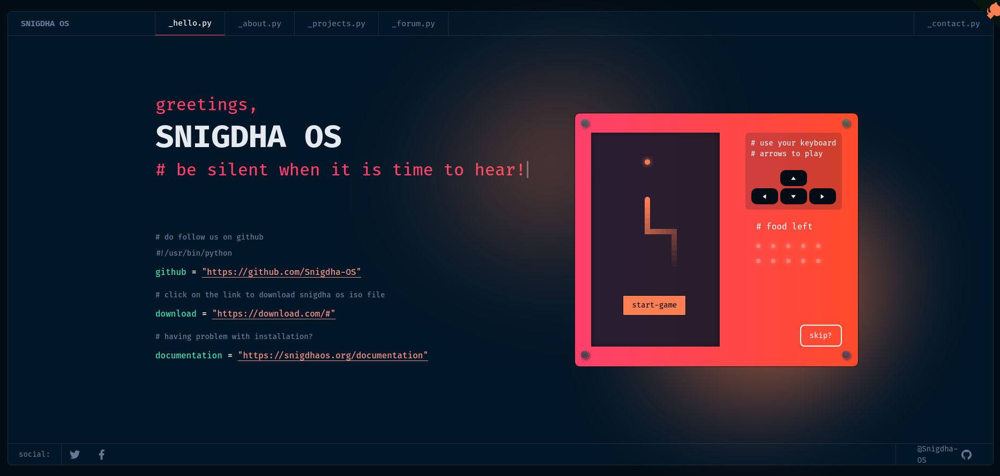

<h1 align="center">
  SNIGDHA OS
</h1>
<p align="center">
  This website has been developed with the open source version of <a href="https://www.figma.com/community/file/1100794861710979147" target="_blank"> Portfolio for Developers Concept V.2</a>, designed by <a href="https://www.behance.net/darelova" target="_blank">@darelova</a> and developed by <a href="https://github.com/alexdeploy">@alexdeploy</a>. Built with <a href="https://nuxt.com/" target="_blank">Nuxt.js 3.0</a>.
</p>
<div align="center">

[](https://app.netlify.com/sites/developer-portfolio-v2/deploys)

</div>

<p align="center">
  <a href="" target="_blank">
    
  </a>
</p>

## 🛠 Installation

1. Clone the project to your local machine.

```sh
git clone https://github.com/Snigdha-OS/Snigdha-OS.github.io.git
```

2. Navigate to the project directory

```sh
cd Snigdha-OS.github.io
```

3. Install the required dependencies

```sh
yarn install
```

4. Start the development server

```sh
yarn dev
```

5. The development server should now be running on <a href="http://localhost:3000/">http://localhost:3000/</a>


## ✒️ Customization

The template includes some default content, but you can easily customize it to fit your needs. Here are some of the things you can change:

* Update the `developer.json` file on root directory, which contains all the text for the project and the portfolio "user" information, including *projects*, *about-me*, *gists* (Ids) and *contact* info.

* Update the `nuxt.config.ts` file for meta tags of website and some additional config.

* Update the `public/pwa/manifest.json` file for PWA config.

* Change the styling and design of the website to match your personal style.

## 🚀 Building and Running for Production

1. Generate a full static production build

```sh
yarn build
```

2. Preview the site as it will appear once deployed.

```sh
yarn preview
```

## 🤝 Contributions

If you find any bugs or have any suggestions, you can open an <a href="https://github.com/Snigdha-OS/Snigdha-OS.github.io/issues">issue</a>.

## 🧾 License

This project is licensed under the MIT License. See the <a href="https://github.com/Snigdha-OS/Snigdha-OS.github.io/blob/master/LICENSE">LICENSE</a> file for more information.